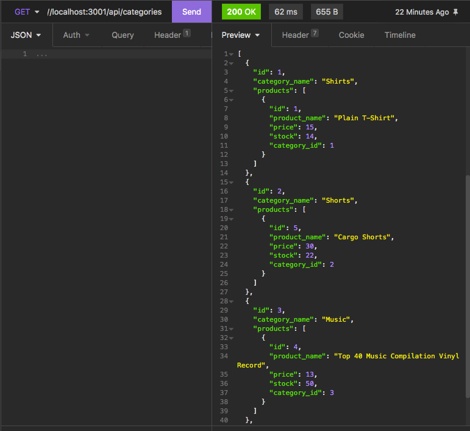
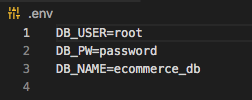

# E-Commerce API

[](https://opensource.org/licenses/MIT)

This is a simple backend API for an e-commerce site written in Node.js, and utilizing a MySQL database. Users can create, read, update, and deleted product categories, products, tags, and product-specific tags by using the various routes offered by the API. Each route will deliver a 200 HTTP request upon success, and a 418 "I'm a teapot" error when something has gone wrong.



### [Demo video](https://watch.screencastify.com/v/u9shyMyW2jPEg3QWIEge)

## Getting Started

In order to get started, download/clone the repository's contents do your computer, then navigate to the root directory ("employee-manager").

## Prerequisites

You will need Node.js in order to run this application: Download it [here](https://nodejs.org/en/).

Additionally, you will need to install the application's dependencies by running the following command within the root directory:

```
npm install
```

Secondly, you will need to ensure to create a MySQL database, then create a .env file including data which looks something like this:



Finally, please ensure to seed your database in order to ensure for easy testing:

```
npm run seed
```

## Using the Application

In order to begin the application, run this command in terminal within the root directory:

```
npm start
```

Then, navigate to [http://localhost:3001](http://localhost:3001)

## Built With

- [Node.js](https://nodejs.org/en/)
- [MySQL](https://www.mysql.com/)
- [Express.js](https://expressjs.com/)
- [Sequelize.js](https://sequelize.org/)

## API Routes

### GET

- /api/categories
- /api/categories/CATEGORYID
- /api/products
- /api/products/PRODUCTID
- /api/tags
- /api/tags/TAGID

### POST

- /api/categories

#### Body example:

```JSON
{
	"category_name": "test"
}
```

- /api/products

#### Body example:

```JSON
{
	"product_name": "Basketball",
	"price": 200.00,
	"stock": 3,
	"tagIds": [1, 2, 3, 4]
}
```

- /api/tags

#### Body example:

```JSON
{
  "tag_name": "orange"
}
```

### PUT

- /api/categories/CATEGORYID

#### Body example:

```JSON
{
	"category_name": "test"
}
```

- /api/products/PRODUCTID

#### Body example:

```JSON
{
	"product_name": "Basketball",
	"price": 200.00,
	"stock": 3,
	"tagIds": [1, 2, 3, 4]
}
```

- /api/tags/TAGID

#### Body example:

```JSON
{
  "tag_name": "orange"
}
```

### DELETE

- /api/categories/CATEGORYID
- /api/categories/PRODUCTID
- /api/tags/TAGID

## Features

- The database is using a Many to Many relationship structure; therefore, products belong to many tags, and tags belong to many products

## Author

**Matt Stephens**

- [Link to Portfolio Site](https://mstephen19.github.io/newestPortfolio)
- [Link to Github](https://github.com/mstephen19)
- [Link to LinkedIn](https://www.linkedin.com/mstephen19)

## License

This project is licensed under the MIT License
